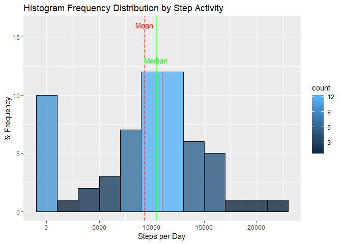
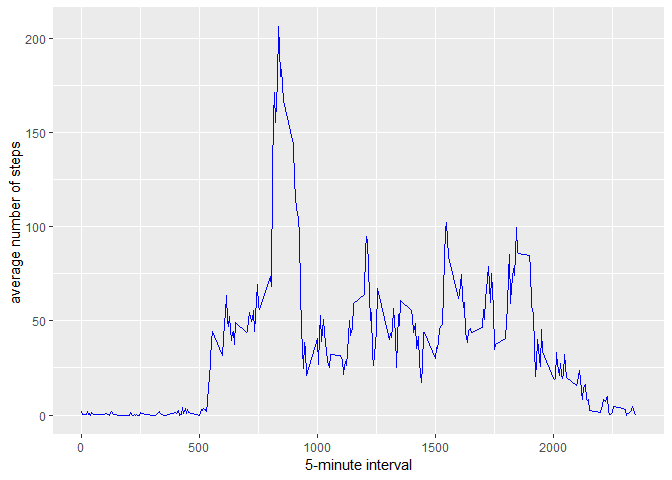
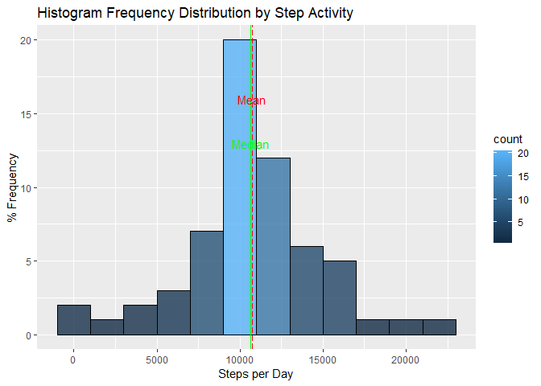
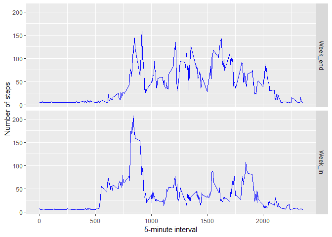

```
## Warning: package 'Hmisc' was built under R version 3.5.2
```

```
## Loading required package: lattice
```

```
## Loading required package: survival
```

```
## Loading required package: Formula
```

```
## Warning: package 'Formula' was built under R version 3.5.2
```

```
## Loading required package: ggplot2
```

```
## 
## Attaching package: 'Hmisc'
```

```
## The following objects are masked from 'package:base':
## 
##     format.pval, units
```

```
## 
## Attaching package: 'dplyr'
```

```
## The following objects are masked from 'package:Hmisc':
## 
##     src, summarize
```

```
## The following objects are masked from 'package:stats':
## 
##     filter, lag
```

```
## The following objects are masked from 'package:base':
## 
##     intersect, setdiff, setequal, union
```

## Loading and preprocessing the data
### Data is presented on the github repo as "activity.zip" we will need to unzip before ### to read And load data


```r
unzip("activity.zip")
activity_tbl <- read.csv("activity.csv")
str(activity_tbl)
```

```
## 'data.frame':	17568 obs. of  3 variables:
##  $ steps   : int  NA NA NA NA NA NA NA NA NA NA ...
##  $ date    : Factor w/ 61 levels "2012-10-01","2012-10-02",..: 1 1 1 1 1 1 1 1 1 1 ...
##  $ interval: int  0 5 10 15 20 25 30 35 40 45 ...
```

```r
total <- tapply(activity_tbl$steps, activity_tbl$date, FUN = sum, na.rm = TRUE)
total1 <- as.data.frame(total)
str(total1)
```

```
## 'data.frame':	61 obs. of  1 variable:
##  $ total: int [1:61(1d)] 0 126 11352 12116 13294 15420 11015 0 12811 9900 ...
```


## What is mean total number of steps taken per day?
###The Mean 


```r
mean_d_activity <- mean(total, na.rm = TRUE)
```

###The Median


```r
median_d_activity <- median(total, na.rm = TRUE)

ggplot(total1, aes(total1$total)) + 
  labs(title = "Histogram Frequency Distribution by Step Activity",
       y="% Frequency", x="Steps per Day")+
  geom_histogram(col="black", aes(fill=..count..),alpha = .8,binwidth = 2000)+
  geom_vline(xintercept = mean_d_activity, colour="red", linetype = "longdash")+ 
  geom_vline(xintercept = median_d_activity, colour="green", linetype = "solid")+
  annotate("text", label = "Mean", x = mean_d_activity, y = 16, colour = "red") +
  annotate("text", label = "Median", x = median_d_activity, y = 13,colour = "green")
```

<!-- -->

## What is the average daily activity pattern?
### time series plot of the 5-minute interval 


```r
av_day_activity <- aggregate(x = list(y1=activity_tbl$steps), by = list(x1=activity_tbl$interval), 
                      FUN = mean, na.rm = TRUE)
ggplot(data = av_day_activity, aes(x = x1, y = y1)) + 
  geom_line(col="blue") + xlab("5-minute interval") + 
  ylab("average number of steps ")
```

<!-- -->

### 5-minute interval containing the maximum number of steps?


```r
intv <- av_day_activity[which.max(av_day_activity$y1), ]
print(paste("The interval",intv$x1, "has the maximum average value of steps",round(intv$y1)))
```

```
## [1] "The interval 835 has the maximum average value of steps 206"
```

## Imputing missing values
### Many days/intervals are missing values (coded as NA)


```r
missing_day_activity <- is.na(activity_tbl$steps)
```

### How many missing


```r
table(missing_day_activity)
```

```
## missing_day_activity
## FALSE  TRUE 
## 15264  2304
```

```r
missing_day_activity <- is.na(activity_tbl$steps)
missing_day_activity <- table (missing_day_activity)

print(paste("Number of missing value",missing_day_activity[2:2]))
```

```
## [1] "Number of missing value 2304"
```
### Filling missing values with mean value for that 5-minute interval
### Creating the requested dataset without NA value


```r
fill_miss_tbl <- activity_tbl
fill_miss_tbl$steps <- round(impute(activity_tbl$steps, fun=mean))

print("Verfied")
```

```
## [1] "Verfied"
```

```r
sum(is.na(fill_miss_tbl[,1]))
```

```
## [1] 0
```

```r
new_total <- tapply(fill_miss_tbl$steps, fill_miss_tbl$date, FUN = sum)
new_total1 <- as.data.frame(new_total)

mean_d_activity1 <- mean(new_total, na.rm = TRUE)
median_d_activity1 <- median(new_total, na.rm = TRUE)
```

### Plotting Histogram


```r
ggplot(new_total1, aes(new_total1$new_total)) + 
  labs(title = "Histogram Frequency Distribution by Step Activity",
       y="% Frequency", x="Steps per Day")+
  geom_histogram(col="black", aes(fill=..count..),alpha = .8,binwidth = 2000)+
  geom_vline(xintercept = mean_d_activity1, colour="red", linetype = "longdash")+ 
  geom_vline(xintercept = median_d_activity1, colour="green", linetype = "solid")+
  annotate("text", label = "Mean", x = mean_d_activity1, y = 16, colour = "red") +
  annotate("text", label = "Median", x = median_d_activity1, y = 13,colour = "green")
```

<!-- -->

```r
print (paste("imputing missing data on the estimates of the total daily number of steps changes"))
```

```
## [1] "imputing missing data on the estimates of the total daily number of steps changes"
```

```r
print ("Mean and median values...They become higher after imputing missing data")
```

```
## [1] "Mean and median values...They become higher after imputing missing data"
```

## Are there differences in activity patterns between weekdays and weekends?
###Create a new factor variable in the dataset with two levels - "weekday" and "weekend" indicating ###whether a given date is a week_day or week_end.


```r
day_week <- function(date_val) 
{
  d <- weekdays(as.Date(date_val, '%Y-%m-%d'))
  if  (!(d == 'Saturday' || d == 'Sunday'||d == 'samedi' || d == 'dimanche')) 
  {
    x <- 'Week_In'
  } 
  else 
  {
    x <- 'Week_end'
  }
  x
}
```

### Creating a new column to activity_tbl dataset


```r
fill_miss_tbl$day_type <- as.factor(sapply(fill_miss_tbl$date,day_week))
```

```
## Warning in strptime(x, format, tz = "GMT"): unable to identify current timezone 'T':
## please set environment variable 'TZ'
```

```r
Step_day<- aggregate(steps ~ interval + day_type, data = fill_miss_tbl, mean)
```

### Plooting


```r
ggplot(Step_day, aes(interval, steps)) + geom_line(col="blue") + facet_grid(day_type ~ .) +
  xlab("5-minute interval") + ylab("Number of steps")
```

<!-- -->
